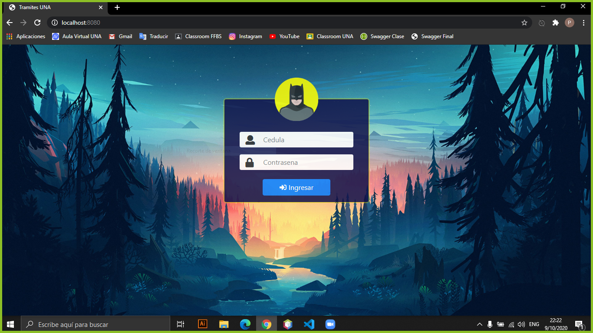
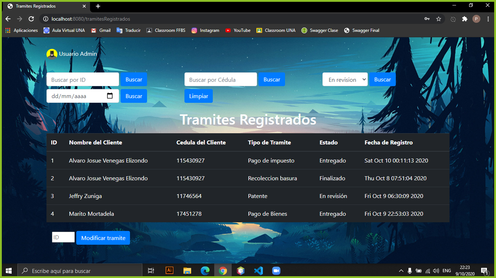
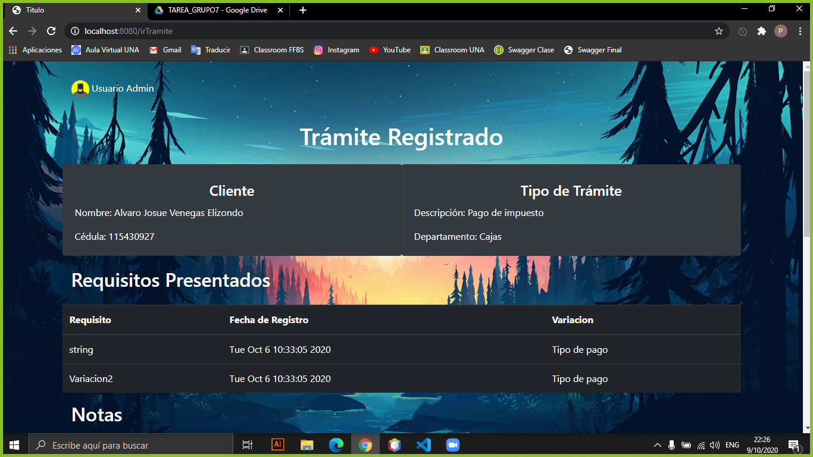

#

#Lenguaje de Programación Golang

Golang es un lenguaje de programación impulsado por Google y publicado como un proyecto de código abierto a finales del año 2011. Golang combina funcionalidades de lenguajes como **C**, **Python** o **Javascript**.

Este **es un lenguaje compilado** pero que toma ideas del funcionamiento de los lenguajes interpretados con tal de conseguir la velocidad que estos brindan, esto permite que el compilado en este lenguaje sea de gran velocidad. Golang también presenta un **tipado estático**, pero tomando la misma idea de implementar funcionalidades en este caso del tipado dinámico. Esto permite crear variables sin establecer el tipo como es el caso de C++ o Java. Sin embargo, una vez el compilador interpreta el tipo de variable, este no podrá cambiar durante la ejecución del programa.

A continuación se puede observar la diferencia al declarar e inicializar una variable en C++ y Golang.

###C++
	int numero = 424

###Golang
	i := 424

##Ventajas de utilizar Golang

* **Compilado multiplataforma:** El compilado en este lenguaje se puede realizar para cualquier sistema operativo, por ejemplo, se puede desarrollar el código en Windows y compilar para un sistema operativo Linux o viceversa.
* **Concurrencia:** Permite una ejecución de procesos sumamente rápida al simular cálculos simultáneos.
* **Formato de código uniforme:** Golang es un lenguaje que tiene un formato establecido a la hora de escribir código, lo que hace su lectura más sencilla, ya que el lector no tiene que descifrar el estilo personal del desarrollador.
* **Imports por defecto:** Todos los archivos y paquetes necesarios para el desarrollo en Golang vienen por defecto y no es necesario descargar software o bibliotecas de terceros.

##Desventajas

* **No tiene tipos genéricos:** El equipo de desarrollo no ha descartado la posibilidad de agregar tipos genéricos al lenguaje, pero de momento este no cuenta con ellos.
* **Es relativamente nuevo:** Esto implica que no tiene tantos paquetes como otros lenguajes, además de que la cantidad de manuales de uso que se pueden encontrar es menor a otros lenguajes con más historia.
* **No utiliza POO:** Pasar de un lenguaje como Java o C++ a Golang puede requerir un poco de esfuerzo, ya que no se pueden utilizar clases, lo que implica que no se puede poner en práctica la herencia o los constructores. 

 
---
#Herramientas Utilizadas
###Visual Studio Code
###Bootstrap
---

#Estructura del Código
Estructuramos nuestro código por medio de carpetas, donde cada una de ellas tiene un archivo.go Estructurando el código de esa manera es necesario exportar las funciones que se van a necesitar en otro archivo, de esta manera debemos importar ese archivo en el lugar donde lo vamos a necesitar y utilizar. Tenemos las siguientes carpetas:

* ConexionServidor
* DTO
* Static
* Templates
* TramitesCliente
* Util

* **ConexionServidor:** Allí se encuentra el archivo donde la conexión se realiza por medio de una solicitud requiest y una respuesta response. En nuestra función POST realizamos un request de tipo POST donde vamos a transformar la estructura a enviar a un json (Marshal) y cuando el API nos da la respuesta por medio del response hacemos la transformación del json a la estructura DTO (Unmarshal) que deseamos. La función GET es bastante similar a la anteriormente mencionada, con la excepción de, cuando necesitamos obtener un objeto por medio de un parámetro especifico, le añadimos el nombre de ese parámetro al URL.

* **DTO:** Allí encontramos el archivo llamado dto.go donde encontramos las estructuras que vamos a mapear y obtener desde el API. 

* **Templates:** vamos a encontrar todos los html implementados en el sistema, dentro de cada html podemos encontrar las direcciones de Bootstrap, ya que lo utilizamos para una mayor flexibilidad y facilidad en el diseño gráfico de la pantalla.

* **Static:** Tenemos todos los estilos css que el sistema va a necesitar, allí también se van a encontrar las imágenes incluidas en los archivos html.

* **TramitesCliente:** Archivo tramitescliente.go, acá es donde se encuentra el main quien es el encargado de llamar los métodos del html, y devolviendo una respuesta con los valores ingresados en el html. Desde este modulo realizamos todas las consultas y validaciones a la API para que nos retorne toda la información que debemos mostrarle al usuario o nos brinde el acceso para realizar distintas tareas en el sistema.

* **Util:** Encontramos las estructuras de cada tabla, con solamente los datos que deseamos mostrar en las vistas, de esta manera podemos omitir información que se considera de poco interés para el usuario. Una buena práctica de programación es mostrarle al usuario solamente lo que necesita y esto es lo que tratamos de realizar en este módulo.

---

##Funcionamiento del sistema
 
Se procede a ingresar el usuario y contraseña para poder entrar a la aplicación

Se muestra una vista con todos los trámites registrados en la base de datos, donde se pueden buscar por ID, cédula, estado y fecha, una vez seleccionado el trámite, se procede a modificarlo presionando el botón correspondiente.

En esta parte de la vista se puede observar al usuario logueado en la esquina superior izquierda. Seguidamente se puede apreciar la información del cliente y del tipo de trámite y luego se puede observar una lista de requisitos presentados para este trámite.

En la parte superior se encuentra una lista de notas relacionadas al trámite registrado, cada nota con su nombre y contenido, seguidamente se encuentra una tabla con los cambios de estado del trámite, en esta parte se puede observar todos los cambios de estado que ha tenido el trámite con el paso del tiempo. Por útlimo se encuentra información sobre el estado actual del trámite y un formulario para cambiar el estado.
#
